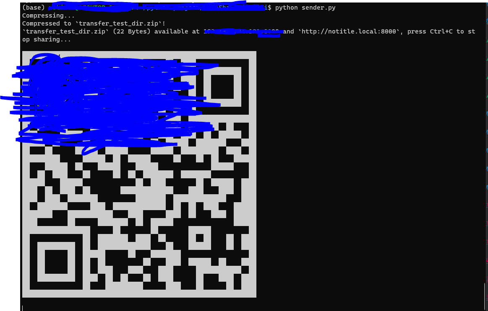
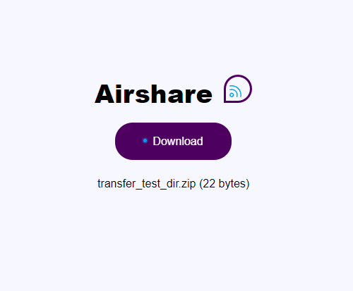

## 개요
- 사람들과 모여서 토이 프로젝트를 하다 보면, 데이터를 주고 받는게 매우 불편하다는것을 느끼게 되었습니다.<br/>
(물론 협업툴로서 굉장히 좋은게 많이 있습니다.)&nbsp;&nbsp;&nbsp;>> <a href="https://www.finereport.com/kr/%ED%94%84%EB%A1%9C%EC%A0%9D%ED%8A%B8-%ED%98%91%EC%97%85%ED%88%B4/" target="_blank">링크</a> <br/>
<br/>
저는 코딩으로 해결해보고 싶다는 생각이 들었고, 알아낸 방법을 공유드립니다!!<br/>
그리하여 airshare를 알게 되었고, 간단한 사용법을 남겨 드립니다.<br/>
사실은 너무 간단합니다..^^;
<br/><br/><br/>

## 설명
갤럭시, 아이폰, 맥, 윈도우 등등 로컬 저장소에 있는 파일 혹은 디렉토리들을 동일한 wifi에 연결되어있다면, 주고 받을수 있게 해주는 python package입니다<br/><br/>


일단 sender.py에 들어가면

```python
from airshare import sender
# 폴더 전송
sender.send_server(code='notitle', file="./transfer_test_dir/")
```
매우 간단하게 되어있습니다!!!(Airshare가 간단하지만 막강해서 사용하였습니다.)<br/>
<br/><br/>
위에서 작성한 send_server()를 살펴보면<br/>
<strong>airshare.sender.send_server(*, code, text=None, file=None, compress=False, port=8000)</strong>

<a  href="https://airshare.readthedocs.io/en/latest/_modules/airshare/sender.html#send_server"  target="_blank">관련링크</a>


첫번째 parameter인 code는 일종의 고유번호(?)라고 생각하시면 됩니다. 동일한 code를 receiver에 입력해야지만 정상적으로 작동합니다.<br/>
(저 같은 경우는, sender.py만 작성해서 파일을 다운로드 받을수 있게 호스팅만 해주고, URL링크로 접속해서 다운로드하는게 편했습니다.)<br/><br/>
두번째 parameter인 text는 말그대로 text를 전송하는것 입니다.<br/>
(아마 코드를 공유하는것일수도 있고, 아니면 정말 다르게(?) 적용해 볼 수도 있다고 생각합니다.)<br/><br/>
세번째로 file은 전송하는 파일 혹은 디렉토리의 경로를 지정해주는 부분입니다.<br/>
(만약 파일을 여러개 보내면, 자동으로 압축됩니다.)<br/><br/>
네번째로 compress는 default값이 False이며, 압축기능을 사용할것인지 말것인지 결정하는 요소입니다.<br/><br/>
다섯번째로 서비스장치에서 호스팅되는 포트번호입니다.<br/><br/>


<br/><br/><br/>

## 실제 실행<br/><br/>


### 사용법은 간단합니다!!<br/><br/>


0. 어떤 파일 혹은 폴더를 전송할지 결정한다.
1. sender.py를 실행한다. `python sebder.py`
2. 실행하면 아래와 같은 CLI창에서 QR코드와 URL주소가 나옵니다.
3. URL 링크를 타고 들어가서 다운로드를 진행하면 됩니다.<br/>
(모바일에서도 URL링크로 접속하신 후 다운로드 가능하시며, QR코드 스캔으로도 가능하십니다.)

<br/><br/>

<br/><br/><br/><br/>

저는 이렇게만 사용해도 매우 편리하게 썻지만, 더 자세하고 다양한 기능들은 아래의 Reference를 참고해 주세요.<br/>
(협업툴을 사용해보시는것도 좋을것 같습니당!! 코딩해보고 싶은 욕구가 더 컸지만, 이걸 코딩이라고 하기에도... 제가 package를 구현한게 아니여서..ㅎㅎ;;)<br/>


<br/><br/><br/>

## 핵심요약
- sender.py에 텍스트를 보낼건지, 파일을 보낼건지 정한다.(파일경로 확인필수!!)
- sender.py를 실행한다.
- 다운로드 받을려는 장치(컴퓨터,모바일)에서 URL 혹은 QR코드를 확인한다.
- 다운로드를 진행한다!

<br/><br/><br/>

## Reference
<ul>
<li><a href="https://github.com/KuroLabs/Airshare" target="_blank">https://github.com/KuroLabs/Airshare</a></li>
<li><a href="https://airshare.rtfd.io" target="_blank">https://airshare.rtfd.io</a></li>
</ul>

